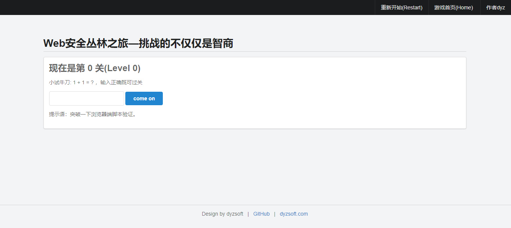

# webgame

* webgame (Web安全丛林之旅) 是Web类hacker闯关的游戏，以web技术为主要挑战项目。
* 包含前端js,cookie,后端数据库中密码存储,密码加盐存储,用户代理判 断和其它非web方面的技术。
* 关卡有简入难,更多关卡正在研究中，欢迎提出您的意见或者建议。


## 依赖版本：
 ├── Beego     : 1.9.2 <br>
 ├── GoVersion : go1.10

## 下载安装：

### windows 系统：
```
    1：安装git软件
    2：安装beego:
        go get github.com/astaxie/beego
    3:下载项目:
        cd  %GOPATH%/src
        git clone https://github.com/dyzsoft/webgame
        cd  webgame
        go  run main.go

    然后打开浏览器，输入http://127.0.0.1:8080/ 既可

    如需修改端口或者其他配置信息，请参考beego 配置文件 conf/app.conf
    
    也可以编译成二进制文件运行

```

### linux & macOS 系统：
    参考 windows 系统


## 系统截图

   **闯关截图** <br>
   <br>
    <br>
   <br>
   <br>
   
   其他关卡暂未截图，各位小伙伴可以尝试闯关
